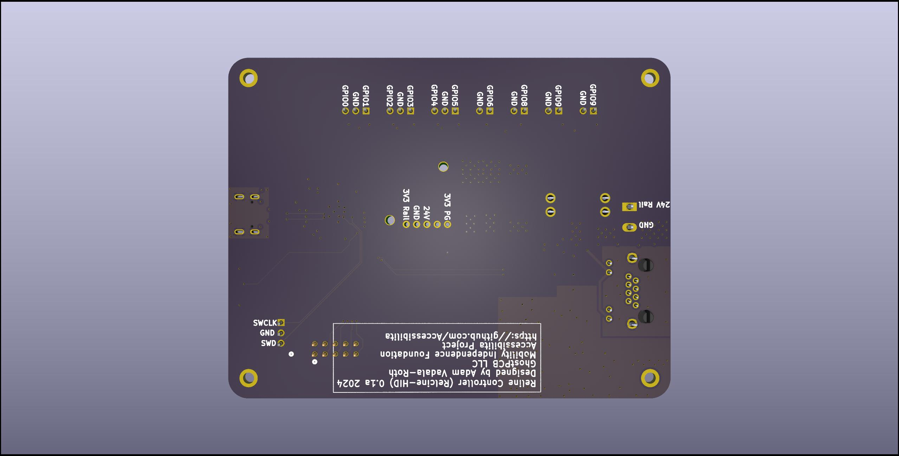
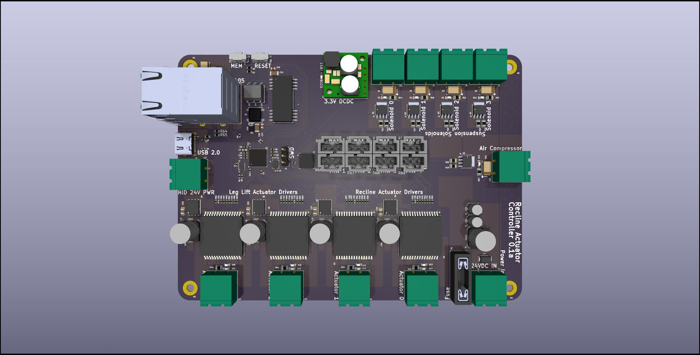
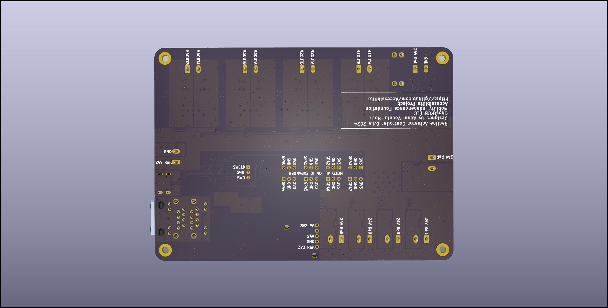
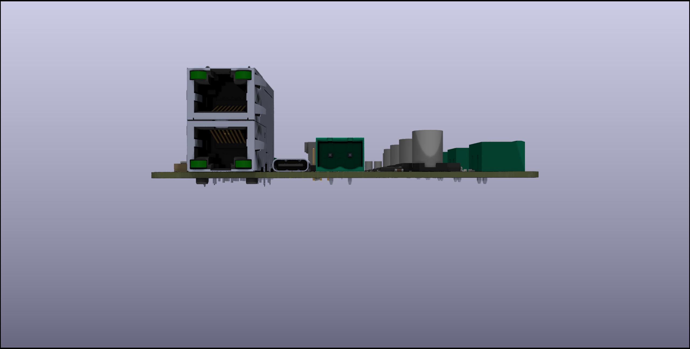

# recline-controls
## Hardware project for open source wheel chair recline control electronics

The Recline control system allows the wheel chair user to adjust the recline position of their chair at their leisrure. Its a complete electrical controls system with with safety in mind. The system is split across two piece of electrical hardware design as two separated printed circuit boards. The First board functions as the controller and human machine interface, the second board functions as an intelligent controller for the actuators, solenoids, and air compressor related to controlling the chair recline postion and the chair's pneumatic suspension.The human machine interface board is called the Reline Control board, and the actuator controller is called the Recline Actuator Control board. 

The system is split across two printed circuit boards for a couple of reasons, the signals from the switches and buttons are low voltage signals, running those signals through long wires would cause problems witha accurately reading the position of the rocker switches and buttons due to voltage drop, the LEDs in the 7 segment display have a low forward voltage and need to be close to the driving source for them to work, if the wire is too long voltage drop would prevent the LEDs from turning on, the other reason is the actuators and solenoids are high voltage signals and need to be mounted close to the control board. The Recline Control Board will be mounted on the arm rest of the users's dominant hand, it runs off 24V power and sends commands to the Recline Actuator control board via RS485 serial communication. The Recline Actuator Control board will be mounted in a secure location most likely at the botton of the chair between the chair and it the rolling chassis, it will be fed 24V power and connect to the Recline Control Baord via RS485. 

## Block Diagram of Entire System

# Board Specs and 3D Renders:

## Recline Control Board 

### Specs:
- RP2040 Microcontroller
- Pololu DCDC Switching Regulator Modules for 3.3V and 5V Power
- Locking Molex connector for Rocker Switches and Buttons
- RJ45 Connector for RS485 Signals 
- Phoenix Contact high voltage connector for Power Input

### 3D Renders:

Top

Bottom

ISO

Side A

Side B

Side C

Side D

## Recline Actuator Control Board

### Specs:
- RP2040 Microcontroller
- Pololu DCDC Switching Regulator Modules for 3.3V and 5V Power
- RJ45 Connector for RS485 Signals 
- Phoenix Contact high voltage connector for Power Input
- Phoenix Contact high voltage connectors for solenoids and DC Motors
- x2 VNH5019 H-Bridges
- 5 MOSFETS for controlling solenoids and air pump

### 3D Renders: 

Top

Bottom

ISO

Side A

Side B

Side C

Side D

