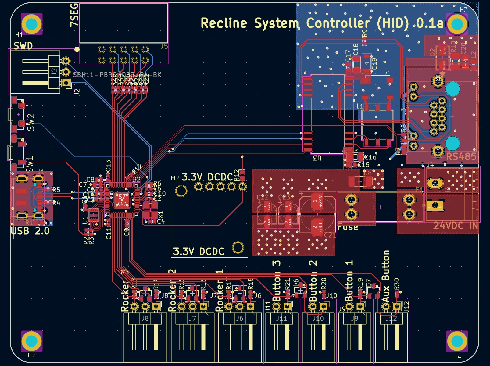
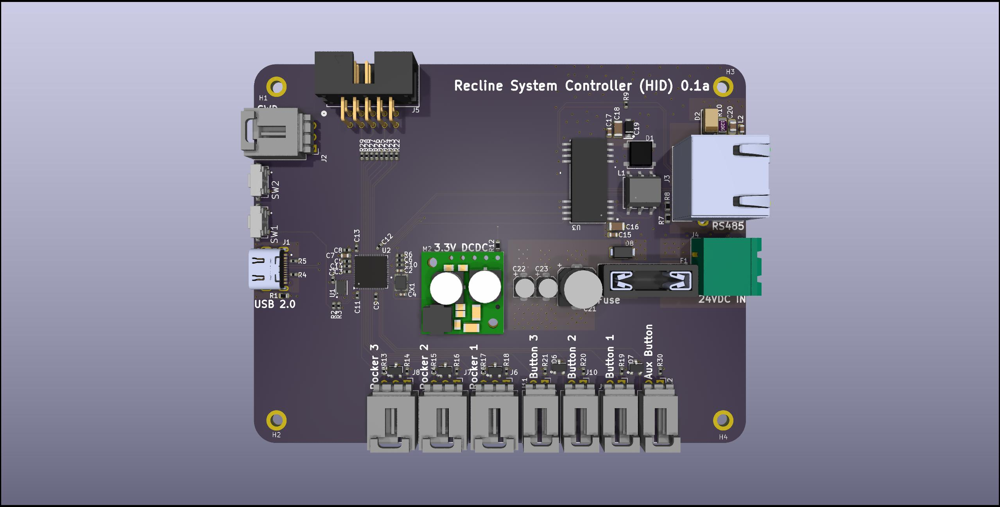
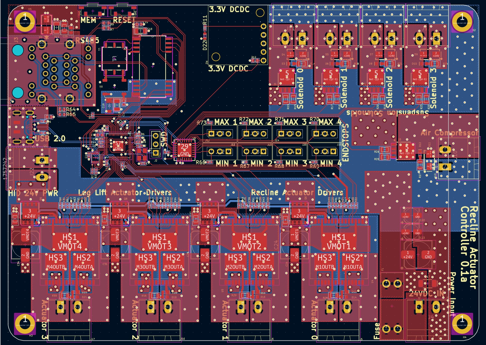
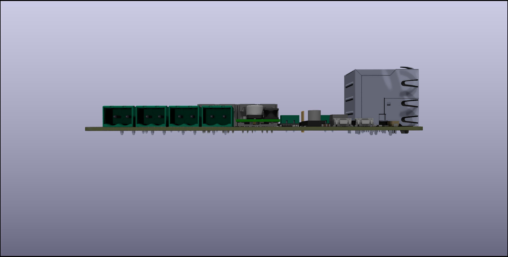

# recline-controls
## Hardware project for open source wheel chair recline control electronics

The Recline control system allows the wheel chair user to adjust the recline position of their chair at their leisrure. Its a complete electrical controls system with with safety in mind. The system is split across two piece of electrical hardware design as two separated printed circuit boards. The First board functions as the controller and human machine interface, the second board functions as an intelligent controller for the actuators, solenoids, and air compressor related to controlling the chair recline postion and the chair's pneumatic suspension.The human machine interface board is called the Reline Control board, and the actuator controller is called the Recline Actuator Control board. 

The system is split across two printed circuit boards for a couple of reasons, the signals from the switches and buttons are low voltage signals, running those signals through long wires would cause problems witha accurately reading the position of the rocker switches and buttons due to voltage drop, the LEDs in the 7 segment display have a low forward voltage and need to be close to the driving source for them to work, if the wire is too long voltage drop would prevent the LEDs from turning on, the other reason is the actuators and solenoids are high voltage signals and need to be mounted close to the control board. The Recline Control Board will be mounted on the arm rest of the users's dominant hand, it runs off 24V power and sends commands to the Recline Actuator control board via RS485 serial communication. The Recline Actuator Control board will be mounted in a secure location most likely at the botton of the chair between the chair and it the rolling chassis, it will be fed 24V power and connect to the Recline Control Baord via RS485. 

## Block Diagram of Entire System

# Board Specs and 3D Renders:

## Recline Control Board 

The other board, called the Recline Control board, functions as the user interface and control center. Here's what it does:

  Acts as the Human-Machine Interface (HMI): This board is where the user interacts with the system, using buttons and rocker switches to adjust the recline position of the chair.
  Processes Low-Voltage Signals: It handles low-voltage signals from the user input controls, like switches and buttons, to avoid issues with voltage drop.
  Displays Information: Includes a 7-segment display to show information, such as the recline position, which requires low forward voltage and needs to be close to the control board to avoid voltage drops.
  Sends Commands via RS485: It sends user commands to the Recline Actuator Control board through RS485 serial communication, which then controls the actuators and other high-voltage components.
  Mounted for User Access: It’s mounted on the armrest of the user's dominant hand, providing easy access for adjustments.

In essence, the Recline Control board is the user-friendly interface, interpreting user input and communicating these commands to the Recline Actuator Control board via RS485 to execute the recline and suspension adjustments.

### Specs:
- RP2040 Microcontroller
- Pololu DCDC Switching Regulator Modules for 3.3V and 5V Power
- Locking Molex connector for Rocker Switches and Buttons
- RJ45 Connector for RS485 Signals 
- Phoenix Contact high voltage connector for Power Input

### 3D Renders:

Top

Bottom

ISO

Side A

Side B

Side C

Side D

## Recline Actuator Control Board

The Recline Actuator Control board manages the high-voltage signals and controls the mechanical components involved in adjusting the wheelchair's recline position and pneumatic suspension. Specifically, it:

- Controls Actuators and Solenoids: It interfaces with and controls the actuators and solenoids that adjust the recline position.
- Manages the Air Compressor: It controls the air compressor for the chair's pneumatic suspension.
- Receives Commands via RS485: The board receives commands from the Recline Control board through an RS485 serial communication link.

In summary, this board serves as the power and actuator management hub, ensuring precise, responsive adjustments to the chair's recline and suspension functions based on user commands.

### Specs:
- RP2040 Microcontroller
- Pololu DCDC Switching Regulator Modules for 3.3V and 5V Power
- RJ45 Connector for RS485 Signals 
- Phoenix Contact high voltage connector for Power Input
- Phoenix Contact high voltage connectors for solenoids and DC Motors
- x2 VNH5019 H-Bridges
- 5 MOSFETS for controlling solenoids and air pump

### 3D Renders: 

Top

Bottom

ISO

Side A

Side B

Side C

Side D

